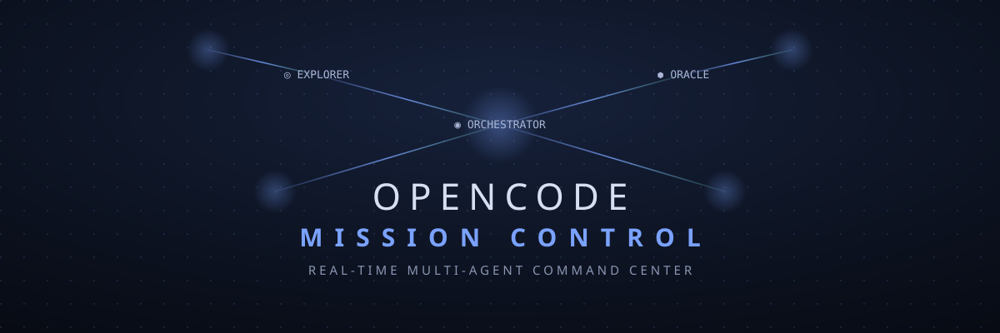
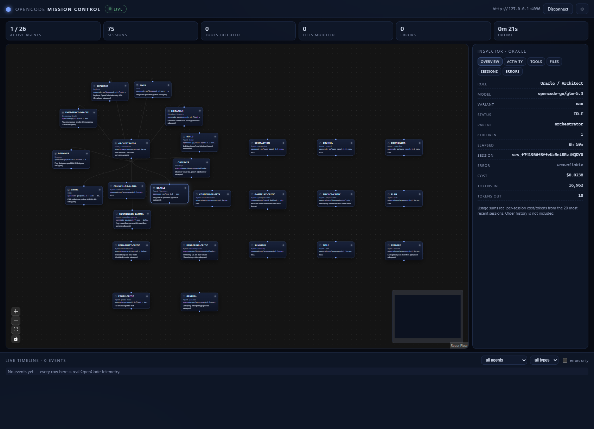

# OpenCode Mission Control


A futuristic real-time desktop dashboard for monitoring OpenCode AI agents and multi-agent workflows.



> **Status:** desktop app in development (Tauri 2 + React). The `web` branch
> is frozen legacy — all new work happens on `main` as the desktop app.
> This is an independent community project, not affiliated with OpenCode.

## The desktop app (primary)

Native Windows app: spawns `opencode serve` itself, lives in the tray,
minimizes instead of quitting, native notifications.

```sh
npm install
npm run tauri dev        # desktop window (needs Rust + MSVC Build Tools)
```

Windows installer (`OpenCode-Mission-Control-Setup-x64.exe`, per-user, no
admin) is built by GitHub Actions on every `v*` tag — see the
[latest release](https://github.com/AGames21/OpenCode-Mission-Control/releases).

## One-line launch (no Tauri build needed)

```powershell
powershell -ExecutionPolicy Bypass -File C:\OpenCodeMissionControl\scripts\start.ps1
```

## One-line launch

```powershell
powershell -ExecutionPolicy Bypass -File C:\OpenCodeMissionControl\scripts\start.ps1
```

Starts `opencode serve` (if needed), starts the dashboard (if needed), and
opens it in your browser. On load it auto-connects — no clicks required.



*Real session: 26 agents, delegation star around the orchestrator, Oracle
inspector showing live model, cost and tokens. Nothing simulated.*

## Desktop shortcut

Option A — automatic:

```powershell
powershell -ExecutionPolicy Bypass -File C:\OpenCodeMissionControl\scripts\shortcut.ps1
```

This creates **OpenCode Mission Control** on your Desktop. Double-click it any
time to launch everything.

Option B — manual: right-click Desktop → **New → Shortcut**, paste as the
location:

```
powershell -ExecutionPolicy Bypass -WindowStyle Hidden -File "C:\OpenCodeMissionControl\scripts\start.ps1"
```

Name it `OpenCode Mission Control`. Done.

## What it shows (all real)

- **Live agent graph** — every agent from your OpenCode server: real model,
  variant, state, latest activity. Edges only from verified parent sessions.
- **Agent inspector** — role, model, variant, parent, children, session,
  elapsed time, real cost and token usage, recent activity, errors.
- **Live timeline** — real SSE events with agent/type/error filters.
- **Stats** — active agents (live + 5-min recency), sessions, tools, files,
  errors, uptime.
- **Reliability** — auto-connect on load, auto-reconnect with backoff, death
  detection when the server vanishes, graceful degradation everywhere.

## Manual start (development)

Requirements: Node 20+, [OpenCode](https://opencode.ai) 1.18+.

```sh
opencode serve --port 4096      # terminal 1: local telemetry server
npm install
npm run dev                     # terminal 2: http://localhost:5199
```

Checks: `npm test` · `npm run typecheck` · `npm run build` · `npm run lint`

## How it connects

Only the official `@opencode-ai/sdk` — no scraping, no DB reads:

| Signal | SDK call | Real? |
|---|---|---|
| Agent list + variants | `app.agents()` | ✅ |
| Sessions | `session.list()` | ✅ |
| Parent/child delegation | `session.children()` | ✅ |
| Cost + tokens | session `cost` / `tokens` | ✅ |
| Per-agent model | session `model` | ✅ |
| Live events | `global.event()` SSE | ✅ |
| Hidden chain-of-thought | — | ❌ never exposed |

Localhost by default. The app warns if you point it at a non-local endpoint.
No analytics, no accounts, nothing leaves the machine.

## Roadmap

- [x] Live telemetry + graph + inspector + timeline + setup
- [x] Chat with any model + agent routing (Codex-style, real prompts)
- [x] Team roster + MCP tool search/install
- [x] Auto-connect, reconnect watchdog, shape-validated detection
- [x] One-line launcher + desktop shortcut
- [ ] Tauri 2 shell (sidecar server, tray, notifications) — scaffolded, CI-built
- [ ] `OpenCode-Mission-Control-Setup-x64.exe` (NSIS, per-user, no admin)
- [ ] Mini always-on-top mode
- [ ] Preset switching with config backup (needs desktop file access)

See [ARCHITECTURE.md](ARCHITECTURE.md) and [DEVELOPMENT.md](DEVELOPMENT.md).

## Contributing

PRs welcome — see the PR template checklist (real-data rule enforced).
Bug reports: use the issue form (app version, OpenCode version, setup).

## License

MIT — see [LICENSE](LICENSE).
